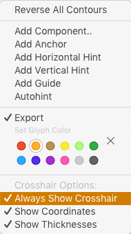

# ShowCrosshairOnSelect.glyphsReporter

This is a plugin for the [Glyphs font editor](http://glyphsapp.com/) by Georg Seifert. It is based on [ShowCrosshair](https://github.com/mekkablue/ShowCrosshair) by [mekkablue](https://github.com/mekkablue). After installation, it will add the menu item *View > Show Crosshair On Select*. You can set a keyboard shortcut in *System Preferences > Keyboard > Shortcuts > App Shortcuts.*

It shows a crosshair when you have something selected, as opposed to the mekkablue version that shows the crosshair at the cursor.

Toggle the display of measurements between intersections with the context menu option *Show Thicknesses*.

Display the crosshair coordinates (of the cursor) in the lower left corner of the active tab by choosing *Show Coordinates On Select*:

By default, the coordinate numbers are displayed at a font size of 10 points. Change their size by pasting this line of code into the Macro Window (*Window > Macro Panel*) and pressing the *Run* button:

    Glyphs.defaults["com.wwwhhhhh.ShowCrosshairOnSelect.fontSize"] = 18.0

Change the value (18.0 in this example) to the desired point size.

### Installation

1. One-click install *Show Crosshair On Select* from *Window > Plugin Manager*
2. Restart Glyphs.

### Usage Instructions

1. Open a glyph in Edit View.
2. Use *View > Show Crosshair On Select* to toggle the display of the crosshair.
3. Access options (see above) in the context menu.

### Requirements

The plugin needs Glyphs 2.4 or higher, running on OS X 10.9 or later. It does NOT work with Glyphs 1.x.

### License

Copyright 2015–2019 Rainer Erich Scheichelbauer (@mekkablue).
Based on sample code by Georg Seifert (@schriftgestalt) and Jan Gerner (@yanone), contributions by Toshi Omagari (@Tosche), based on code by Rafał Buchner (@RafalBuchner).

Licensed under the Apache License, Version 2.0 (the "License");
you may not use this file except in compliance with the License.
You may obtain a copy of the License at

http://www.apache.org/licenses/LICENSE-2.0

See the License file included in this repository for further details.
